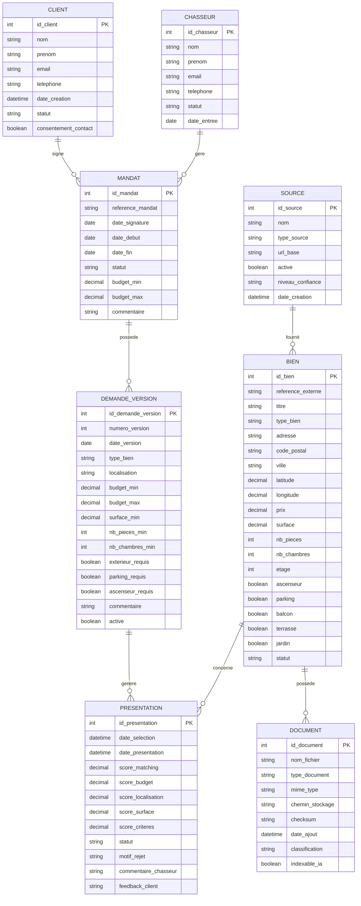

yes# MCD MERISE — Real Estate Intelligence Platform

**Projet :** Real Estate Intelligence Platform  
**Domaine :** Chasse immobilière / Property Intelligence  
**Méthode :** MERISE  
**Version :** 1.0  
**Statut :** Baseline conceptuelle  
**Dernière mise à jour :** 2026-08-21

---

# 1. Objectif

Ce document définit le **Modèle Conceptuel de Données — MCD** du projet.

Il constitue la représentation métier des informations manipulées par la plateforme avant traduction vers :

```text
MCD
 |
 v
MLD
 |
 v
MPD PostgreSQL
 |
 v
migration.sql
 |
 v
Database
```

Le MCD doit rester indépendant autant que possible :

- de PostgreSQL ;
- de FastAPI ;
- de Kubernetes ;
- de l'ORM ;
- du frontend ;
- des choix d'implémentation.

Il répond principalement à la question :

> Quelles données métier existent et comment sont-elles reliées ?

---

# 2. Périmètre métier

Le périmètre initial couvre le processus suivant :

```text
Client
  |
  v
Mandat de recherche
  |
  v
Expression du besoin
  |
  v
Recherche de biens
  |
  v
Qualification
  |
  v
Présentation au client
```

Les informations liées aux biens peuvent provenir de plusieurs sources et être enrichies avec des documents.

---

# 3. Principales entités

Le modèle comprend huit entités métier principales :

```text
CLIENT
CHASSEUR
MANDAT
DEMANDE_VERSION
BIEN
PRESENTATION
SOURCE
DOCUMENT
```

---

# 4. Vue conceptuelle

```text
CLIENT
   |
   | signe
   v
MANDAT
   |
   | est pris en charge par
   v
CHASSEUR

MANDAT
   |
   | possède
   v
DEMANDE_VERSION

DEMANDE_VERSION
   |
   | sélectionne / présente
   v
PRESENTATION
   |
   | concerne
   v
BIEN

BIEN
   |
   +-------- provient de --------> SOURCE
   |
   +-------- possède ------------> DOCUMENT
```

---

# 5. Entité CLIENT

## Définition

Le CLIENT représente une personne ou entité ayant recours au service de chasse immobilière.

## Identifiant

```text
id_client
```

## Attributs

| Attribut | Description |
|---|---|
| id_client | Identifiant métier interne |
| nom | Nom du client |
| prenom | Prénom |
| email | Adresse email |
| telephone | Téléphone |
| date_creation | Date de création du dossier |
| statut | Statut du client |
| consentement_contact | Consentement de contact lorsque applicable |

## Règles

- Un client peut avoir plusieurs mandats au cours du temps.
- Un mandat appartient à un seul client.
- L'email peut être unique selon la règle métier retenue.
- Les données personnelles sont soumises au RGPD.

---

# 6. Entité CHASSEUR

## Définition

Le CHASSEUR représente le professionnel responsable du traitement d'un mandat de recherche.

## Identifiant

```text
id_chasseur
```

## Attributs

| Attribut | Description |
|---|---|
| id_chasseur | Identifiant interne |
| nom | Nom |
| prenom | Prénom |
| email | Adresse professionnelle |
| telephone | Téléphone |
| statut | Actif / inactif |
| date_entree | Date d'entrée dans l'organisation |

## Règles

- Un chasseur peut gérer plusieurs mandats.
- Un mandat est rattaché à un chasseur principal.
- Un chasseur inactif ne doit normalement pas recevoir de nouveau mandat.

---

# 7. Entité MANDAT

## Définition

Le MANDAT représente l'engagement contractuel entre un client et le service de chasse immobilière.

## Identifiant

```text
id_mandat
```

## Attributs

| Attribut | Description |
|---|---|
| id_mandat | Identifiant du mandat |
| reference_mandat | Référence métier |
| date_signature | Date de signature |
| date_debut | Date de début |
| date_fin | Date de fin prévue ou réelle |
| statut | Brouillon / actif / suspendu / terminé / annulé |
| budget_min | Budget minimum indicatif |
| budget_max | Budget maximum |
| commentaire | Commentaire général |

## Règles

- Un mandat appartient à un seul client.
- Un mandat est géré par un chasseur principal.
- Un client peut signer plusieurs mandats.
- Un chasseur peut gérer plusieurs mandats.
- Un mandat peut connaître plusieurs versions successives de la demande client.

---

# 8. Pourquoi DEMANDE_VERSION

La demande d'un client peut évoluer.

Exemple :

```text
Version 1
Montpellier
Appartement
300 000 €
60 m² minimum

       |
       v

Version 2
Montpellier + périphérie
Appartement ou maison
350 000 €
70 m² minimum
```

Écraser les critères précédents ferait perdre l'historique.

Le modèle conserve donc des versions.

```text
MANDAT
   |
   v
DEMANDE_VERSION 1
DEMANDE_VERSION 2
DEMANDE_VERSION 3
```

---

# 9. Entité DEMANDE_VERSION

## Définition

DEMANDE_VERSION représente une version datée des critères de recherche d'un mandat.

## Identifiant

```text
id_demande_version
```

## Attributs

| Attribut | Description |
|---|---|
| id_demande_version | Identifiant |
| numero_version | Numéro de version |
| date_version | Date d'application |
| type_bien | Appartement, maison, terrain, etc. |
| localisation | Zone recherchée |
| budget_min | Budget minimum |
| budget_max | Budget maximum |
| surface_min | Surface minimale |
| nb_pieces_min | Nombre minimal de pièces |
| nb_chambres_min | Nombre minimal de chambres |
| exterieur_requis | Balcon, terrasse, jardin |
| parking_requis | Parking obligatoire ou non |
| ascenseur_requis | Ascenseur requis |
| commentaire | Critères libres |
| active | Version active ou historique |

## Règles

- Un mandat possède au moins une version de demande lorsqu'il entre en recherche active.
- Une demande version appartient à un seul mandat.
- Un mandat peut posséder plusieurs versions.
- Une seule version devrait normalement être active à un instant donné.
- `numero_version` est unique à l'intérieur d'un mandat.

---

# 10. Entité BIEN

## Définition

Le BIEN représente un bien immobilier identifié par la plateforme.

## Identifiant

```text
id_bien
```

## Attributs

| Attribut | Description |
|---|---|
| id_bien | Identifiant interne |
| reference_externe | Référence de l'annonce ou de la source |
| titre | Titre |
| type_bien | Type de bien |
| adresse | Adresse |
| code_postal | Code postal |
| ville | Ville |
| latitude | Latitude si disponible |
| longitude | Longitude si disponible |
| prix | Prix |
| surface | Surface |
| nb_pieces | Nombre de pièces |
| nb_chambres | Nombre de chambres |
| etage | Étage |
| ascenseur | Présence ascenseur |
| parking | Présence parking |
| balcon | Présence balcon |
| terrasse | Présence terrasse |
| jardin | Présence jardin |
| description | Description |
| date_publication | Date de publication |
| date_collecte | Date de collecte |
| statut | Actif / expiré / vendu / indisponible |

## Règles

- Un bien peut être présenté à plusieurs demandes.
- Un bien peut provenir d'une ou plusieurs sources selon l'évolution du modèle.
- Un bien peut avoir plusieurs documents.
- Une référence externe n'est pas nécessairement globalement unique entre différentes sources.

---

# 11. Entité SOURCE

## Définition

SOURCE représente l'origine d'une information immobilière.

Exemples :

```text
Agence immobilière
Portail immobilier
Import manuel
Partenaire
Open Data
API
```

## Identifiant

```text
id_source
```

## Attributs

| Attribut | Description |
|---|---|
| id_source | Identifiant |
| nom | Nom de la source |
| type_source | Portail / agence / API / manuel |
| url_base | URL éventuelle |
| active | Source active ou non |
| niveau_confiance | Niveau de confiance éventuel |
| date_creation | Date d'enregistrement |

## Règles

- Une source peut fournir plusieurs biens.
- Un bien doit être relié à au moins une source lorsque son origine est connue.

---

# 12. Relation SOURCE — BIEN

La première version du modèle retient :

```text
SOURCE (0,N)
    |
    | fournit
    |
BIEN (1,1)
```

Cela signifie :

- une source peut fournir zéro à plusieurs biens ;
- un bien provient d'une source principale.

Cette simplification est adaptée au MVP.

Si le même bien doit être consolidé depuis plusieurs portails, le modèle pourra évoluer vers :

```text
SOURCE (0,N)
     |
     | PUBLICATION
     |
BIEN (0,N)
```

avec une entité associative `PUBLICATION`.

Cette évolution n'est pas nécessaire dans le MCD initial.

---

# 13. Entité PRESENTATION

## Définition

PRESENTATION représente le fait qu'un bien a été sélectionné et proposé dans le contexte d'une demande client donnée.

Elle sert également à stocker le résultat du matching entre :

```text
DEMANDE_VERSION
```

et :

```text
BIEN
```

## Identifiant

```text
id_presentation
```

## Attributs

| Attribut | Description |
|---|---|
| id_presentation | Identifiant |
| date_selection | Date de sélection |
| date_presentation | Date réelle de présentation |
| score_matching | Score global de matching |
| score_budget | Score budget |
| score_localisation | Score localisation |
| score_surface | Score surface |
| score_criteres | Score autres critères |
| statut | Identifié / qualifié / présenté / rejeté / visité / retenu |
| motif_rejet | Motif éventuel |
| commentaire_chasseur | Analyse du chasseur |
| feedback_client | Retour du client |

---

# 14. Pourquoi PRESENTATION est une entité

La relation :

```text
DEMANDE_VERSION <----> BIEN
```

est de type plusieurs-à-plusieurs.

Une même demande peut correspondre à plusieurs biens.

Un même bien peut correspondre à plusieurs demandes.

Cette relation possède elle-même des informations :

```text
score
status
feedback
date
```

Elle doit donc devenir une entité associative :

```text
PRESENTATION
```

---

# 15. Relation DEMANDE_VERSION — PRESENTATION

Cardinalités :

```text
DEMANDE_VERSION (0,N)
        |
        | donne lieu à
        |
PRESENTATION (1,1)
```

Une demande peut ne produire aucune présentation ou en produire plusieurs.

Une présentation appartient exactement à une version de demande.

---

# 16. Relation BIEN — PRESENTATION

Cardinalités :

```text
BIEN (0,N)
   |
   | est concerné par
   |
PRESENTATION (1,1)
```

Un bien peut n'être présenté à personne ou être associé à plusieurs demandes.

Chaque présentation concerne exactement un bien.

---

# 17. Entité DOCUMENT

## Définition

DOCUMENT représente un document ou fichier associé à un bien.

Exemples :

```text
PDF annonce
Diagnostic
Photo
Plan
Brochure
Rapport
Note
```

## Identifiant

```text
id_document
```

## Attributs

| Attribut | Description |
|---|---|
| id_document | Identifiant |
| nom_fichier | Nom |
| type_document | Type fonctionnel |
| mime_type | Type MIME |
| chemin_stockage | URI ou chemin logique |
| checksum | Hash d'intégrité éventuel |
| date_ajout | Date |
| classification | Public / interne / confidentiel |
| indexable_ia | Autorisation d'indexation AI/RAG |

---

# 18. Relation BIEN — DOCUMENT

Cardinalités :

```text
BIEN (0,N)
   |
   | possède
   |
DOCUMENT (1,1)
```

Un bien peut ne posséder aucun document.

Un document appartient à un seul bien dans le modèle initial.

---

# 19. Cardinalités globales

| Association | Entité A | Cardinalité A | Entité B | Cardinalité B |
|---|---|---:|---|---:|
| SIGNE | CLIENT | 0,N | MANDAT | 1,1 |
| GERE | CHASSEUR | 0,N | MANDAT | 1,1 |
| VERSIONNE | MANDAT | 0,N | DEMANDE_VERSION | 1,1 |
| FOURNIT | SOURCE | 0,N | BIEN | 1,1 |
| MATCH_DEMANDE | DEMANDE_VERSION | 0,N | PRESENTATION | 1,1 |
| MATCH_BIEN | BIEN | 0,N | PRESENTATION | 1,1 |
| POSSEDE_DOCUMENT | BIEN | 0,N | DOCUMENT | 1,1 |

---

# 20. MCD — représentation MERISE simplifiée

```text
+----------------+
|     CLIENT     |
+----------------+
| #id_client     |
| nom            |
| prenom         |
| email          |
| telephone      |
| statut         |
+----------------+
        |
      (0,N)
        |
      SIGNE
        |
      (1,1)
        |
        v
+----------------+
|     MANDAT     |
+----------------+
| #id_mandat     |
| reference      |
| dates          |
| statut         |
| budget         |
+----------------+
        ^
        |
      (1,1)
       GERE
        |
      (0,N)
        |
+----------------+
|    CHASSEUR    |
+----------------+
| #id_chasseur   |
| nom            |
| prenom         |
| email          |
| statut         |
+----------------+

MANDAT
  |
(0,N)
  |
VERSIONNE
  |
(1,1)
  v

+-----------------------+
|   DEMANDE_VERSION     |
+-----------------------+
| #id_demande_version   |
| numero_version        |
| localisation          |
| budget                |
| surface               |
| criteres              |
+-----------------------+
          |
        (0,N)
          |
          v
+-----------------------+
|     PRESENTATION      |
+-----------------------+
| #id_presentation      |
| score_matching        |
| statut                |
| feedback              |
+-----------------------+
          ^
          |
        (0,N)
          |
+-----------------------+
|         BIEN          |
+-----------------------+
| #id_bien              |
| reference_externe     |
| type                  |
| ville                 |
| prix                  |
| surface               |
| caracteristiques      |
+-----------------------+
       |         |
       |         |
       |         +------ (0,N) DOCUMENT
       |
       +---------------- SOURCE
```

---

# 21. Diagramme Mermaid ER

Le diagramme suivant facilite la visualisation dans les outils supportant Mermaid.



---

# 22. Modèle logique dérivé — aperçu

Le MCD implique le futur MLD suivant :

```text
CLIENT
------
PK id_client


CHASSEUR
--------
PK id_chasseur


MANDAT
------
PK id_mandat
FK id_client
FK id_chasseur


DEMANDE_VERSION
---------------
PK id_demande_version
FK id_mandat


SOURCE
------
PK id_source


BIEN
----
PK id_bien
FK id_source


PRESENTATION
------------
PK id_presentation
FK id_demande_version
FK id_bien


DOCUMENT
--------
PK id_document
FK id_bien
```

---

# 23. Contraintes logiques attendues

## CLIENT

```text
email
```

peut recevoir une contrainte d'unicité si la règle métier est confirmée.

---

## MANDAT

```text
reference_mandat
```

doit être unique.

---

## DEMANDE_VERSION

Couple unique :

```text
(id_mandat, numero_version)
```

---

## PRESENTATION

Une même combinaison :

```text
(id_demande_version, id_bien)
```

ne doit normalement apparaître qu'une fois.

Une contrainte :

```text
UNIQUE(id_demande_version, id_bien)
```

est donc envisagée.

---

# 24. Contraintes de valeurs

Exemples :

```text
budget_min >= 0
budget_max >= 0
surface_min >= 0
prix >= 0
surface >= 0
score_matching BETWEEN 0 AND 100
```

---

# 25. Règle budget

Si les deux valeurs existent :

```text
budget_min <= budget_max
```

Cette règle pourra être matérialisée via `CHECK`.

---

# 26. Score matching

Le score global peut être calculé à partir de plusieurs sous-scores.

Exemple conceptuel :

```text
Score Global
   =
Budget
+
Localization
+
Surface
+
Other Criteria
```

La formule exacte appartient à la partie :

```text
BC05 / C5 — Modèle Matching IA
```

Le MCD prévoit seulement les emplacements nécessaires à sa traçabilité.

---

# 27. Historisation de la demande

Le choix de `DEMANDE_VERSION` permet :

```text
Original Need
     |
     v
Modification
     |
     v
New Version
```

sans perte de l'état précédent.

Cela facilite :

- audit ;
- matching historique ;
- explication des décisions ;
- comparaison des résultats.

---

# 28. Historisation des biens

Le modèle initial ne crée pas encore d'entité :

```text
BIEN_VERSION
```

Les modifications d'annonce peuvent être historisées ultérieurement si le besoin apparaît.

Ce choix évite une complexité prématurée.

---

# 29. Gestion des sources

Le MVP retient une source principale par bien.

Future évolution possible :

```text
BIEN
  |
  v
PUBLICATION
  ^
  |
SOURCE
```

pour représenter :

- plusieurs annonces du même bien ;
- plusieurs prix ;
- différentes dates ;
- différentes URLs.

---

# 30. Documents et RAG

L'entité DOCUMENT prépare une future capacité RAG.

```text
DOCUMENT
    |
    v
Classification
    |
    v
indexable_ia?
    |
  +---+---+
  |       |
 YES      NO
  |       |
  v       v
RAG     Excluded
```

Cela permet d'intégrer la gouvernance AI dès le modèle métier.

---

# 31. RGPD

Les principales données personnelles sont concentrées dans :

```text
CLIENT
CHASSEUR
```

et potentiellement dans :

```text
DOCUMENT
COMMENTAIRES
FEEDBACK
```

Le modèle doit être relié au :

```text
REGISTRE-RGPD.md
```

---

# 32. Minimisation

Le modèle ne doit pas stocker une information personnelle simplement parce qu'elle pourrait être utile plus tard.

Principe :

```text
Business Purpose
      |
      v
Required Data
```

---

# 33. Sécurité

Les futurs droits applicatifs devront contrôler notamment :

```text
CLIENT
MANDAT
DEMANDE_VERSION
DOCUMENT
```

Les tables ne doivent pas être directement exposées au frontend.

---

# 34. Data Governance

Dans OpenMetadata, les entités pourront progressivement être associées à :

- owner ;
- description ;
- classification ;
- glossary ;
- lineage ;
- Data Quality.

---

# 35. Data Quality — CLIENT

Exemples :

```text
id_client NOT NULL
email valid format
statut accepted values
```

---

# 36. Data Quality — MANDAT

Exemples :

```text
reference unique
client exists
chasseur exists
budget_min <= budget_max
```

---

# 37. Data Quality — DEMANDE_VERSION

Exemples :

```text
numero_version > 0
surface_min >= 0
budget_min <= budget_max
one active version per mandate
```

La règle d'une seule version active pourra nécessiter une contrainte SQL avancée ou un contrôle applicatif.

---

# 38. Data Quality — BIEN

Exemples :

```text
prix >= 0
surface >= 0
source exists
valid status
```

---

# 39. Data Quality — PRESENTATION

Exemples :

```text
score_matching between 0 and 100
request exists
property exists
unique request/property association
```

---

# 40. Cycle de vie métier

```text
CLIENT
   |
   v
MANDAT
   |
   v
DEMANDE_VERSION
   |
   v
SEARCH / MATCH
   |
   v
BIEN
   |
   v
PRESENTATION
   |
   v
CLIENT FEEDBACK
```

---

# 41. Processus de matching

Le MCD prépare :

```text
DEMANDE_VERSION
      |
      +------------------+
      |                  |
      v                  v
Requirements           BIEN
      |                  |
      +--------+---------+
               |
               v
            Matching
               |
               v
         PRESENTATION
```

---

# 42. Séparation matching et bien

Le score de matching n'est pas un attribut intrinsèque d'un bien.

Exemple :

```text
BIEN A
```

peut avoir :

```text
95%
```

pour un client et :

```text
42%
```

pour un autre.

Le score appartient donc à :

```text
PRESENTATION
```

et non à :

```text
BIEN
```

---

# 43. Séparation critères et mandat

Les critères sont placés dans :

```text
DEMANDE_VERSION
```

et non directement dans :

```text
MANDAT
```

afin de préserver l'historique.

---

# 44. Entités hors périmètre initial

Les concepts suivants peuvent exister dans une version future :

```text
VISITE
OFFRE
NEGOCIATION
TRANSACTION
AGENCE
AGENT
PUBLICATION
COMMUNE
ZONE_RECHERCHE
FEATURE
MATCH_DETAIL
AI_EVALUATION
```

Ils ne sont pas inclus dans la version 1 afin de garder un modèle cohérent avec le MVP.

---

# 45. Pourquoi ne pas tout modéliser maintenant

Le principe est :

```text
Model the current business need
not every possible future need.
```

Chaque entité supplémentaire entraîne :

- règles ;
- foreign keys ;
- migrations ;
- tests ;
- API ;
- gouvernance.

---

# 46. Validation métier à effectuer

Avant passage au MLD définitif, valider :

```text
CLIENT
CHASSEUR
MANDAT
DEMANDE_VERSION
SOURCE
BIEN
PRESENTATION
DOCUMENT
```

et les règles :

```text
Client -> several mandates
Chasseur -> several mandates
Mandat -> several request versions
Source -> several properties
Request version -> several presentations
Property -> several presentations
Property -> several documents
```

---

# 47. MCD final version 1

```text
CLIENT (0,N)
    |
    | SIGNE
    |
MANDAT (1,1)


CHASSEUR (0,N)
    |
    | GERE
    |
MANDAT (1,1)


MANDAT (0,N)
    |
    | VERSIONNE
    |
DEMANDE_VERSION (1,1)


SOURCE (0,N)
    |
    | FOURNIT
    |
BIEN (1,1)


DEMANDE_VERSION (0,N)
    |
    | GENERE
    |
PRESENTATION (1,1)


BIEN (0,N)
    |
    | CONCERNE
    |
PRESENTATION (1,1)


BIEN (0,N)
    |
    | POSSEDE
    |
DOCUMENT (1,1)
```

---

# 48. Étape suivante

Une fois ce MCD validé, le travail suivant sera :

```text
MCD
 |
 v
MLD
 |
 v
PostgreSQL MPD
 |
 v
migration.sql
```

Le `migration.sql` devra inclure :

- tables ;
- PK ;
- FK ;
- UNIQUE ;
- CHECK ;
- indexes justifiés ;
- timestamps utiles.

---

# 49. Preuve attendue

Pour BC05 / C1 :

```text
MCD-MERISE-PROJET.md
        |
        v
MLD
        |
        v
migration.sql
        |
        v
PostgreSQL
        |
        v
Executed validation
```

---

# 50. Statut

| Élément | Statut |
|---|---|
| Périmètre métier | DÉFINI |
| Entités | DÉFINIES |
| Attributs | DÉFINIS |
| Relations | DÉFINIES |
| Cardinalités | DÉFINIES |
| Historisation demande | DÉFINIE |
| Matching relationship | DÉFINIE |
| Document/RAG readiness | DÉFINIE |
| RGPD considerations | DOCUMENTÉES |
| Mermaid ER diagram | DISPONIBLE |
| MLD | PROCHAINE ÉTAPE |
| MPD PostgreSQL | À PRODUIRE |
| migration.sql | À PRODUIRE |
| SQL execution | À PRODUIRE |

---

# 51. Conclusion

Le modèle conceptuel repose sur le cœur métier :

```text
CLIENT
   |
   v
MANDAT
   |
   v
DEMANDE_VERSION
   |
   v
PRESENTATION
   |
   v
BIEN
```

en ajoutant :

```text
CHASSEUR
SOURCE
DOCUMENT
```

pour représenter respectivement :

- la responsabilité métier ;
- la provenance de l'information ;
- les contenus associés aux biens.

La structure permet ensuite d'intégrer proprement :

```text
Matching
AI
RAG
Data Governance
RGPD
Analytics
```

sans déplacer ces responsabilités dans le modèle de base de manière incohérente.

---

**MCD MERISE V1 — READY FOR MLD**