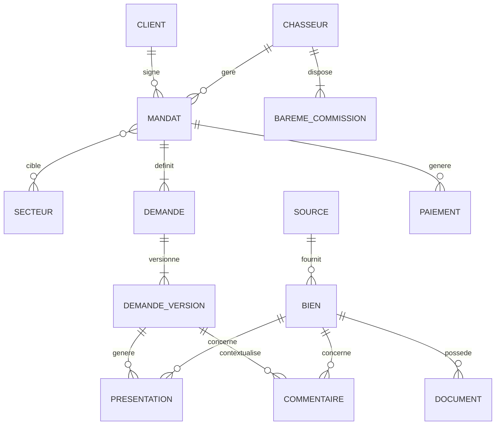

# MCD MERISE — Real Estate Intelligence Platform

**Projet :** Real Estate Intelligence Platform  
**Domaine :** Chasse immobilière  
**Méthode :** MERISE  
**Version :** 2.0  
**Statut :** Baseline conceptuelle corrigée selon le StarterPack  
**Date de référence métier :** 25 juillet 2026

---

# 1. Objectif

Ce document définit le Modèle Conceptuel de Données cible du projet.

Il est construit à partir :

1. du SI hérité fourni dans les fixtures ;
2. des besoins métier décrits dans le StarterPack ;
3. des besoins futurs Data et IA ;
4. des exigences de traçabilité, RGPD et croissance.

La chaîne de conception est :

```text
SI hérité
   |
   v
Audit
   |
   v
MCD cible
   |
   v
MLD
   |
   v
MPD PostgreSQL
   |
   v
migration.sql
```

---

# 2. SI hérité

Le SI existant contient uniquement :

```text
SECTEURS
UTILISATEURS
MANDATS
```

Il constitue la source de migration.

Il ne doit pas être modifié directement.

---

# 3. Principales anomalies du modèle hérité

Le modèle existant présente notamment :

```text
UTILISATEURS
    |
    +--> clients
    |
    +--> chasseurs
```

dans une seule table.

Cela produit des colonnes dépendantes du rôle :

```text
taux_commission
budget_max
```

qui n'ont pas de sens pour tous les utilisateurs.

Les critères de recherche sont également stockés sous forme de texte libre :

```text
mandats.description_recherche
```

alors qu'ils doivent devenir structurés et historisables.

---

# 4. Exigences métier du modèle cible

Le modèle cible doit permettre de gérer :

```text
Clients
Chasseurs
Secteurs
Mandats
Demandes structurées
Historique des demandes
Biens
Sources d'annonces
Commentaires
Présentations / matching
Documents
Barèmes de commission
Paiements
```

---

# 5. Vue globale

```text
CLIENT
   |
   | signe
   v
MANDAT
   ^
   |
   | géré par
   |
CHASSEUR

MANDAT
   |
   | définit
   v
DEMANDE
   |
   | possède
   v
DEMANDE_VERSION

DEMANDE_VERSION
   |
   +-----------------------------+
   |                             |
   v                             v
PRESENTATION                 COMMENTAIRE
   |                             |
   v                             v
BIEN <---------------------------+

BIEN
   |
   +--> SOURCE
   |
   +--> DOCUMENT

CHASSEUR
   |
   v
BAREME_COMMISSION

MANDAT
   |
   v
PAIEMENT
```

---

# 6. Entité CLIENT

## Définition

Représente un particulier utilisant le service de chasse immobilière.

## Identifiant

```text
id_client
```

## Attributs

| Attribut | Description |
|---|---|
| id_client | Identifiant |
| nom | Nom |
| prenom | Prénom |
| email | Email |
| telephone | Téléphone |
| ville | Ville |
| date_creation | Date de création |
| statut | Statut |
| consentement_contact | Consentement de contact |

## Règles

- un client peut posséder plusieurs mandats ;
- un mandat appartient à un seul client ;
- les données personnelles sont soumises au RGPD.

---

# 7. Entité CHASSEUR

## Définition

Représente le professionnel chargé d'accompagner le client.

## Identifiant

```text
id_chasseur
```

## Attributs

| Attribut | Description |
|---|---|
| id_chasseur | Identifiant |
| nom | Nom |
| prenom | Prénom |
| email | Email professionnel |
| telephone | Téléphone |
| date_entree | Date d'entrée |
| statut | Actif / inactif |

## Règles

- un chasseur peut gérer plusieurs mandats ;
- un mandat possède un chasseur référent ;
- les commissions ne doivent plus être stockées directement dans cette entité.

Les commissions sont historisées via :

```text
BAREME_COMMISSION
```

---

# 8. Entité SECTEUR

## Définition

Représente une zone géographique couverte par le service.

Cette entité est conservée car elle existe déjà dans le SI hérité.

## Identifiant

```text
id_secteur
```

## Attributs

| Attribut | Description |
|---|---|
| id_secteur | Identifiant |
| pays | Pays |
| ville | Ville |
| quartier | Quartier éventuel |
| code_postal | Code postal |
| actif | Secteur actif |

## Évolution

Le modèle doit pouvoir évoluer au-delà de Montpellier vers :

```text
France
DROM
Espagne
Allemagne
Royaume-Uni
Irlande
BeNeLux
Italie
Suisse
```

---

# 9. Entité MANDAT

## Définition

Représente le contrat de recherche signé entre le client et l'entreprise.

## Identifiant

```text
id_mandat
```

## Attributs

| Attribut | Description |
|---|---|
| id_mandat | Identifiant |
| reference_mandat | Référence |
| type_mandat | Exclusif / non-exclusif |
| date_signature | Date de signature |
| mode_signature | Papier / électronique / autre |
| date_debut | Début du mandat |
| date_fin | Fin de validité |
| statut | Statut |
| commentaire | Commentaire |

## Relations

```text
CLIENT      0,N ---- SIGNE ---- 1,1 MANDAT
CHASSEUR    0,N ---- GERE ----- 1,1 MANDAT
SECTEUR     0,N ---- CIBLE ---- 0,N MANDAT
```

## Règle de validité

Le mandat est valable six mois.

Conceptuellement :

```text
date_fin = date_signature + 6 mois
```

Le renouvellement doit être historisé plutôt que d'effacer l'état précédent.

---

# 10. Pourquoi séparer MANDAT et DEMANDE

Le mandat représente :

```text
le contrat
```

La demande représente :

```text
le besoin immobilier
```

Ces deux concepts ne doivent pas être confondus.

Exemple :

```text
MANDAT
6 mois
exclusif
signé électroniquement
```

et :

```text
DEMANDE
Appartement
Montpellier
350 000 €
70 m²
```

---

# 11. Entité DEMANDE

## Définition

Représente la recherche immobilière associée à un mandat.

## Identifiant

```text
id_demande
```

## Attributs

| Attribut | Description |
|---|---|
| id_demande | Identifiant |
| date_creation | Création |
| statut | Active / clôturée |
| id_mandat | Mandat concerné |

## Relations

```text
MANDAT 1,1 ---- POSSEDE ---- 1,N DEMANDE
```

Dans le MVP, un mandat peut généralement correspondre à une demande principale, mais le modèle autorise l'évolution.

---

# 12. Entité DEMANDE_VERSION

## Définition

Représente une version historique des critères structurés d'une demande.

## Identifiant

```text
id_demande_version
```

## Attributs

| Attribut | Description |
|---|---|
| id_demande_version | Identifiant |
| numero_version | Numéro |
| date_version | Date du changement |
| auteur_type | Client / chasseur / système |
| auteur_id | Identifiant de l'auteur selon contexte |
| motif_modification | Pourquoi la demande a changé |
| ville | Ville recherchée |
| code_postal | Code postal |
| type_bien | Type |
| budget_min | Budget minimum |
| budget_max | Budget maximum |
| surface_min | Surface minimale |
| nb_pieces_min | Pièces minimum |
| nb_chambres_min | Chambres minimum |
| dpe_max | DPE maximum éventuel |
| criteres_souhaites | Critères supplémentaires |
| active | Version courante |

---

# 13. Historisation obligatoire

Une demande ne doit jamais être écrasée.

```text
DEMANDE
   |
   +--> VERSION 1
   |
   +--> VERSION 2
   |
   +--> VERSION 3
```

Chaque changement doit conserver au minimum :

```text
date
auteur
motif
```

---

# 14. Correspondance avec le générateur StarterPack

Le générateur fournit des critères structurés contenant notamment :

```text
reference
date_creation
ville
code_postal
type_bien
budget_max
surface_min
nb_pieces_min
nb_chambres_min
dpe_max
criteres_souhaites
```

Ces données alimenteront le modèle :

```text
DEMANDE
+
DEMANDE_VERSION
```

---

# 15. Entité SOURCE

## Définition

Représente la provenance d'une annonce immobilière.

## Exemples

```text
Agence
Particulier
Plateforme
API
Open Data
```

## Attributs

| Attribut | Description |
|---|---|
| id_source | Identifiant |
| nom | Source |
| type_source | Type |
| url_base | URL |
| actif | Statut |
| niveau_confiance | Niveau de confiance |

---

# 16. Entité BIEN

## Définition

Représente un bien immobilier normalisé dans le SI cible.

## Identifiant

```text
id_bien
```

## Attributs principaux

| Attribut | Description |
|---|---|
| id_bien | Identifiant |
| reference_externe | Référence source |
| type_bien | Type |
| titre | Titre |
| adresse | Adresse |
| code_postal | Code postal |
| ville | Ville |
| latitude | Latitude |
| longitude | Longitude |
| prix | Prix |
| surface | Surface |
| nb_pieces | Pièces |
| nb_chambres | Chambres |
| dpe | DPE |
| description | Description |
| date_publication | Publication |
| date_collecte | Collecte |
| statut | Statut |

---

# 17. Données d'annonces hétérogènes

Les données sources peuvent être volontairement :

```text
incomplètes
mal nommées
dans différents formats
semi-structurées
```

Le modèle `BIEN` représente donc la version normalisée après ingestion.

Flux :

```text
CSV / JSON / API
      |
      v
RAW
      |
      v
STAGING
      |
      v
NORMALISATION
      |
      v
BIEN
```

---

# 18. Entité PRESENTATION

## Définition

Représente le fait qu'un bien a été sélectionné ou proposé pour une version de demande.

## Attributs

| Attribut | Description |
|---|---|
| id_presentation | Identifiant |
| date_selection | Date |
| date_presentation | Date client |
| score_matching | Score |
| statut | Identifié / qualifié / présenté / rejeté / visité / retenu |

## Relation

```text
DEMANDE_VERSION 0,N
        |
        v
PRESENTATION
        ^
        |
BIEN 0,N
```

---

# 19. Entité COMMENTAIRE

## Définition

Représente un commentaire sur un bien dans le contexte d'une demande.

Le commentaire peut être produit par :

```text
client
chasseur
```

## Attributs

| Attribut | Description |
|---|---|
| id_commentaire | Identifiant |
| date_commentaire | Date |
| auteur_type | CLIENT / CHASSEUR |
| auteur_id | Auteur |
| contenu | Texte |
| priorite | Priorité éventuelle |
| decision | Retenir / écarter / visiter / autre |

## Relations

```text
COMMENTAIRE
   |
   +--> DEMANDE_VERSION
   |
   +--> BIEN
```

---

# 20. Pourquoi COMMENTAIRE et PRESENTATION sont distincts

`PRESENTATION` représente :

```text
la relation de sélection / matching
```

`COMMENTAIRE` représente :

```text
l'interaction humaine sur le bien
```

Un même bien présenté peut recevoir plusieurs commentaires.

---

# 21. Entité DOCUMENT

## Définition

Représente un document associé à un bien.

Exemples :

```text
photo
PDF
diagnostic
plan
brochure
vidéo
audio
```

## Attributs

```text
id_document
id_bien
nom_fichier
type_document
mime_type
chemin_stockage
checksum
classification
indexable_ia
date_ajout
```

---

# 22. Entité BAREME_COMMISSION

## Définition

Représente les règles de rémunération d'un chasseur.

Les commissions peuvent varier :

```text
par chasseur
par période
par tranche de montant
```

## Identifiant

```text
id_bareme
```

## Attributs

| Attribut | Description |
|---|---|
| id_bareme | Identifiant |
| id_chasseur | Chasseur |
| montant_min | Début de tranche |
| montant_max | Fin de tranche |
| taux_commission | Taux |
| montant_fixe | Montant fixe éventuel |
| date_debut_validite | Début |
| date_fin_validite | Fin |
| actif | Statut |

---

# 23. Historisation des commissions

Une modification de commission ne doit pas écraser les anciennes règles.

```text
CHASSEUR
   |
   +--> BAREME 2025
   |
   +--> BAREME 2026
```

Cela permet de recalculer correctement une rémunération historique.

---

# 24. Entité PAIEMENT

## Définition

Représente les flux financiers liés à l'aboutissement d'un mandat.

## Attributs

| Attribut | Description |
|---|---|
| id_paiement | Identifiant |
| id_mandat | Mandat |
| date_acte_authentique | Date de signature finale |
| montant_achat | Montant du bien |
| montant_honoraires | Honoraires entreprise |
| montant_chasseur | Rémunération chasseur |
| date_reception_honoraires | Réception entreprise |
| date_paiement_chasseur | Paiement chasseur |
| statut | Prévu / vérifié / programmé / payé |

---

# 25. Pourquoi conserver le montant d'achat

Les règles de commission utilisent notamment :

```text
montant du projet
```

Le paiement doit donc permettre de conserver la valeur utilisée pour calculer les honoraires et la rémunération.

---

# 26. Relation BAREME_COMMISSION — PAIEMENT

Au moment du calcul :

```text
CHASSEUR
   |
   v
BAREME applicable à la date
   |
   v
Montant achat
   |
   v
Rémunération
```

Le résultat financier doit rester traçable.

---

# 27. Performance chasseur

Les indicateurs métier décrits comprennent notamment :

```text
délai mandat -> achat
exclusivité
nombre de ventes réussies
nombre de mandats signés
nombre de visites avant achat
```

Ces indicateurs ne doivent pas nécessairement être stockés définitivement.

Ils peuvent être calculés à partir des données opérationnelles et analytiques.

---

# 28. Future extension — VISITE

Le processus métier comporte explicitement des visites.

Une future entité :

```text
VISITE
```

sera probablement nécessaire.

Elle pourra contenir :

```text
id_visite
id_demande
id_bien
id_chasseur
date_visite
type_visite
compte_rendu
```

Cette entité sera ajoutée lorsque le parcours applicatif correspondant sera implémenté.

---

# 29. Future extension — OFFRE

Le processus métier comporte également des offres d'achat.

Une future entité :

```text
OFFRE
```

pourra contenir :

```text
montant
date
statut
signature
```

Elle n'est pas indispensable au premier MPD BC05 si le périmètre retenu reste centré sur Data + matching.

---

# 30. Cardinalités principales

| Association | A | Card. | B | Card. |
|---|---|---:|---|---:|
| SIGNE | CLIENT | 0,N | MANDAT | 1,1 |
| GERE | CHASSEUR | 0,N | MANDAT | 1,1 |
| CIBLE | SECTEUR | 0,N | MANDAT | 0,N |
| DEFINIT | MANDAT | 1,1 | DEMANDE | 1,N |
| VERSIONNE | DEMANDE | 1,1 | DEMANDE_VERSION | 1,N |
| FOURNIT | SOURCE | 0,N | BIEN | 1,1 |
| MATCH | DEMANDE_VERSION | 0,N | PRESENTATION | 1,1 |
| CONCERNE | BIEN | 0,N | PRESENTATION | 1,1 |
| COMMENTE | DEMANDE_VERSION | 0,N | COMMENTAIRE | 1,1 |
| SUR | BIEN | 0,N | COMMENTAIRE | 1,1 |
| DOCUMENTE | BIEN | 0,N | DOCUMENT | 1,1 |
| REMUNERE | CHASSEUR | 1,N | BAREME_COMMISSION | 1,1 |
| REGLE | MANDAT | 0,N | PAIEMENT | 1,1 |

---

# 31. MCD simplifié

```text
                     SECTEUR
                        |
                        |
CLIENT --------> MANDAT <-------- CHASSEUR
                  |
                  |
                  v
               DEMANDE
                  |
                  v
           DEMANDE_VERSION
              /       \
             /         \
            v           v
    PRESENTATION    COMMENTAIRE
          |             |
          +------ BIEN -+
                    |
                    +--> SOURCE
                    |
                    +--> DOCUMENT


CHASSEUR
   |
   v
BAREME_COMMISSION


MANDAT
   |
   v
PAIEMENT
```

---

# 32. Mermaid ER



---

# 33. Mapping héritage → cible

```text
UTILISATEURS
    |
    +--> CLIENT
    |
    +--> CHASSEUR
```

selon :

```text
role
```

---

```text
SECTEURS
    |
    v
SECTEUR
```

avec évolution pour l'international.

---

```text
MANDATS
    |
    +--> MANDAT
    |
    +--> DEMANDE
    |
    +--> DEMANDE_VERSION
```

Le champ :

```text
description_recherche
```

doit être transformé progressivement en critères structurés.

---

# 34. Migration de description_recherche

Le texte libre existant ne doit pas être détruit.

Une stratégie possible :

```text
Legacy description_recherche
        |
        v
Preserve raw text
        |
        v
Structured extraction
        |
        v
DEMANDE_VERSION
```

La migration automatique devra être prudente car toutes les informations ne sont pas forcément extractibles avec certitude.

---

# 35. Données générées

Le nouveau générateur du StarterPack produit :

```text
recherches.csv
annonces.csv
JSON annonces
```

Ces données ne représentent pas le SI hérité.

Elles constituent des données synthétiques destinées aux phases :

```text
ingestion
normalisation
matching
3V
OLAP
IA
```

---

# 36. Data Architecture

La trajectoire cible devient :

```text
Legacy Fixtures
      |
      v
Migration
      |
      v
Operational Model


Generated Announcements
      |
      v
RAW
      |
      v
STAGING
      |
      v
Normalized BIEN
```

---

# 37. Matching

Le modèle de matching consomme principalement :

```text
DEMANDE_VERSION
+
BIEN
```

et produit :

```text
PRESENTATION
```

avec :

```text
score
ranking
status
```

---

# 38. Feedback

Les interactions :

```text
COMMENTAIRE
```

peuvent ensuite servir à :

```text
requalification de demande
analytics
future AI feedback
```

---

# 39. RGPD

Les données personnelles principales résident notamment dans :

```text
CLIENT
CHASSEUR
COMMENTAIRE
DOCUMENT
PAIEMENT
```

Le modèle doit donc être relié au registre RGPD.

---

# 40. AI Privacy

Les informations transmises au matching ou à un LLM doivent être minimisées.

Exemple :

```text
DEMANDE_VERSION
```

peut être utilisée sans transmettre :

```text
CLIENT.email
CLIENT.telephone
```

---

# 41. Modèle cible minimum

Le modèle cible retenu avant passage au MLD est donc :

```text
CLIENT
CHASSEUR
SECTEUR
MANDAT
DEMANDE
DEMANDE_VERSION
SOURCE
BIEN
PRESENTATION
COMMENTAIRE
DOCUMENT
BAREME_COMMISSION
PAIEMENT
```

---

# 42. Évolutions applicatives futures

Entités pouvant être ajoutées pendant l'implémentation applicative :

```text
VISITE
OFFRE
FACTURE
ACTE
NOTAIRE
RENOUVELLEMENT_MANDAT
```

Elles ne doivent être ajoutées que lorsque leur besoin technique est réellement implémenté.

---

# 43. Statut

| Élément | Statut |
|---|---|
| Legacy model identified | COMPLETE |
| Client / chasseur split | COMPLETE |
| Secteur preserved | COMPLETE |
| Mandat corrected | COMPLETE |
| Structured demand | COMPLETE |
| Demand versioning | COMPLETE |
| Author + modification reason | COMPLETE |
| Bien | COMPLETE |
| Source | COMPLETE |
| Presentation | COMPLETE |
| Commentaire | COMPLETE |
| Document | COMPLETE |
| Commission scale | COMPLETE |
| Payment | COMPLETE |
| Generator mapping | COMPLETE |
| MLD V2 | NEXT |
| MPD V2 | AFTER MLD |
| migration.sql | AFTER MPD |

---

# 44. Conclusion

Le modèle cible corrige les principales limites du SI hérité :

```text
Mixed users
        |
        v
CLIENT + CHASSEUR


Free-text search
        |
        v
DEMANDE + VERSIONING


Static commission
        |
        v
HISTORICAL COMMISSION SCALE


Missing real-estate model
        |
        v
BIEN + SOURCE


Missing interaction context
        |
        v
PRESENTATION + COMMENTAIRE


Missing payment lifecycle
        |
        v
PAIEMENT
```

Le modèle est désormais aligné à la fois avec :

```text
Legacy system
+
StarterPack requirements
+
Future growth
+
OLTP / OLAP
+
Matching / AI
```

---

**MCD MERISE V2 — READY FOR MLD V2**