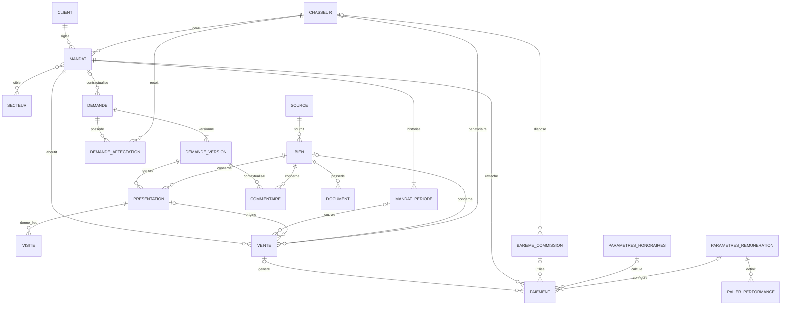

# MCD MERISE — Real Estate Intelligence Platform

**Projet :** PROJECT_FIL_ROUGE / CHASSE_IMMOBILIERE
**Méthode :** MERISE
**Version :** 3.0
**Statut :** Modèle conceptuel aligné avec l’implémentation
**Périmètre vérifié :** migrations 001 à 012
**Dernière mise à jour :** 2026-09-15

---

# 1. Objectif

Ce document décrit le **Modèle Conceptuel de Données (MCD)** de la plateforme Real Estate Intelligence.

Il représente les concepts métier, leurs responsabilités, leurs relations et leurs cardinalités, indépendamment des choix physiques PostgreSQL.

La chaîne documentaire est :

```text
Besoins métier
      |
      v
MCD
      |
      v
MLD
      |
      v
MPD PostgreSQL
      |
      v
Migrations SQL
      |
      v
Tests
      |
      v
Runtime PostgreSQL
```

Cette version remplace l’ancien MCD V2 et reflète les évolutions réellement implémentées jusqu’à la migration `012_chasseur_entry_date_backfill.sql`.

---

# 2. Périmètre métier

La plateforme couvre désormais le parcours :

```text
CLIENT
   |
   v
DEMANDE
   |
   +--> AFFECTATION CHASSEUR
   |
   v
DEMANDE_VERSION
   |
   v
MATCHING
   |
   v
PRESENTATION
   |
   v
VISITE
   |
   v
VENTE
   |
   v
CALCUL DE REMUNERATION
   |
   v
PAIEMENT
```

Le processus contractuel associé est :

```text
CLIENT
   |
   v
MANDAT
   |
   v
MANDAT_PERIODE
   |
   +--> INITIAL
   |
   +--> RENOUVELLEMENT
```

La plateforme couvre également :

* l’authentification et les identités applicatives ;
* l’affectation des demandes aux chasseurs ;
* l’historisation des critères de recherche ;
* l’ingestion et la normalisation des biens ;
* le matching ;
* les présentations ;
* les visites ;
* les ventes ;
* les honoraires ;
* la rémunération des chasseurs ;
* le cycle de paiement ;
* l’audit métier.

---

# 3. Principes de modélisation

Le modèle respecte les principes suivants.

## 3.1 Séparation contrat / besoin

```text
MANDAT != DEMANDE
```

Le mandat représente une relation contractuelle.

La demande représente un besoin de recherche immobilière.

Une demande peut désormais être créée **avant la signature d’un mandat**.

---

## 3.2 Historisation des critères

Les critères d’une demande ne sont jamais écrasés.

```text
DEMANDE
   |
   +--> DEMANDE_VERSION 1
   +--> DEMANDE_VERSION 2
   +--> DEMANDE_VERSION 3
```

Chaque modification produit une nouvelle version traçable.

---

## 3.3 Affectation indépendante

L’affectation d’un chasseur à une demande est distincte du mandat.

```text
DEMANDE
   |
   v
DEMANDE_AFFECTATION
   |
   v
CHASSEUR
```

Cela permet de traiter une demande avant contractualisation.

---

## 3.4 Historisation contractuelle

Un renouvellement de mandat ne remplace pas l’historique précédent.

```text
MANDAT
   |
   +--> PERIODE 1 — INITIAL
   |
   +--> PERIODE 2 — RENOUVELLEMENT
   |
   +--> PERIODE 3 — RENOUVELLEMENT
```

Chaque période contractuelle est conservée.

---

## 3.5 Séparation transaction / calcul / paiement

Trois concepts sont distingués :

```text
VENTE
=
transaction immobilière aboutie
```

```text
REMUNERATION
=
calcul métier déterministe
```

```text
PAIEMENT
=
résultat de calcul figé
+
cycle financier
```

Cette séparation garantit la reproductibilité et l’auditabilité du calcul.

---

# 4. Vue conceptuelle globale

```text
                         SECTEUR
                            ^
                            |
                    MANDAT_SECTEUR
                            |
                            v

CLIENT ---------------> MANDAT <---------------- CHASSEUR
  |                       |
  |                       +----> MANDAT_PERIODE
  |
  v
DEMANDE
  |
  +----> DEMANDE_AFFECTATION <------------------ CHASSEUR
  |
  v
DEMANDE_VERSION
  |
  +------------------+
  |                  |
  v                  v
PRESENTATION      COMMENTAIRE
  |                  |
  v                  |
 BIEN <---------------+
  |
  +----> SOURCE
  |
  +----> DOCUMENT
  ^
  |
PRESENTATION
  |
  v
VISITE

MANDAT
  |
  +----------+
  |          |
  v          v
VENTE <--- PRESENTATION
  |
  +--------> BIEN
  |
  +--------> MANDAT_PERIODE
  |
  +--------> CHASSEUR bénéficiaire
  |
  v
CALCUL REMUNERATION
  |
  v
PAIEMENT
  |
  +--------> BAREME_COMMISSION
  |
  +--------> PARAMETRES_HONORAIRES
  |
  +--------> PARAMETRES_REMUNERATION
                         |
                         v
                 PALIER_PERFORMANCE
```

Deux concepts transverses complètent ce modèle :

```text
UTILISATEUR
    |
    +--> identité / authentification / rôle

AUDIT_LOG
    |
    +--> traçabilité des opérations métier
```

---

# 5. CLIENT

## Définition

Le client représente la personne pour laquelle une recherche immobilière est réalisée.

Il porte notamment :

* identité ;
* coordonnées ;
* ville ;
* statut ;
* consentement de contact.

## Relations

Un client peut avoir :

```text
0,N DEMANDE
0,N MANDAT
```

Un mandat appartient à exactement un client.

---

# 6. CHASSEUR

## Définition

Le chasseur représente le professionnel chargé du traitement des recherches immobilières.

Il possède notamment :

* identité ;
* coordonnées ;
* date d’entrée ;
* statut.

La date d’entrée intervient dans le calcul d’ancienneté utilisé par la rémunération.

Lorsque l’information RH historique n’était pas disponible, les données héritées ont été complétées à partir de la première activité métier connue avec une provenance explicitement documentée.

## Relations

Un chasseur peut :

```text
gérer plusieurs mandats
recevoir plusieurs affectations de demandes
être bénéficiaire de plusieurs ventes
disposer de barèmes historiques
```

---

# 7. UTILISATEUR

## Définition

`UTILISATEUR` représente l’identité applicative utilisée pour l’authentification et l’autorisation.

Il ne remplace pas les concepts métier `CLIENT` et `CHASSEUR`.

Les rôles applicatifs sont :

```text
ADMIN
CLIENT
CHASSEUR
SERVICE
```

Un utilisateur `CLIENT` référence une identité métier client.

Un utilisateur `CHASSEUR` référence une identité métier chasseur.

Les comptes `ADMIN` et `SERVICE` ne nécessitent pas d’identité client ou chasseur.

## Principe

```text
Identité métier
!=
Identité d'authentification
```

Cette séparation permet de conserver un modèle métier propre tout en supportant le RBAC applicatif.

---

# 8. SECTEUR

## Définition

Le secteur représente une zone géographique couverte par l’activité.

Il peut contenir :

```text
pays
ville
quartier
code postal
```

Le modèle n’est pas limité conceptuellement à la France.

## Relation avec MANDAT

Un mandat peut cibler plusieurs secteurs.

Un secteur peut être ciblé par plusieurs mandats.

La relation est donc :

```text
MANDAT N,N SECTEUR
```

conceptuellement matérialisée par l’association :

```text
MANDAT_SECTEUR
```

---

# 9. MANDAT

## Définition

Le mandat représente le contrat de recherche conclu avec le client.

Il définit notamment :

```text
référence
type
signature
mode de signature
période contractuelle courante
statut
client
chasseur référent
```

Les types sont :

```text
EXCLUSIF
NON_EXCLUSIF
```

## Relations

```text
CLIENT    0,N ---- SIGNE ---- 1,1 MANDAT
CHASSEUR  0,N ---- GERE ----- 1,1 MANDAT
MANDAT    0,N ---- CIBLE ---- 0,N SECTEUR
```

---

# 10. MANDAT_PERIODE

## Définition

`MANDAT_PERIODE` représente une période contractuelle historisée d’un mandat.

Elle permet de distinguer :

```text
INITIAL
RENOUVELLEMENT
```

## Règle métier

Une période contractuelle standard dure :

```text
6 mois calendaires
```

Conceptuellement :

```text
date_fin = date_debut + 6 mois
```

Les données historiques héritées peuvent être identifiées explicitement lorsqu’elles ne permettent pas de garantir cette règle avec la même précision.

## Renouvellement

Un renouvellement ne modifie pas la période précédente.

Exemple :

```text
MANDAT
 |
 +-- PERIODE 1
 |     INITIAL
 |     2026-01-05 -> 2026-07-05
 |
 +-- PERIODE 2
       RENOUVELLEMENT
       2026-07-05 -> 2027-01-05
```

La nouvelle période commence à la frontière de la période précédente.

## Cardinalité

```text
MANDAT 1,1 ---- POSSEDE ---- 1,N MANDAT_PERIODE
```

---

# 11. DEMANDE

## Définition

La demande représente le besoin immobilier exprimé par le client.

Elle existe indépendamment de la contractualisation.

Une demande peut donc être :

```text
créée
qualifiée
affectée
versionnée
```

avant qu’un mandat soit signé.

## Relation avec MANDAT

La relation est désormais optionnelle côté demande :

```text
MANDAT 0,N ---- CONTRACTUALISE ---- 0,1 DEMANDE
```

Une demande héritée provenant d’un ancien mandat conserve obligatoirement son mandat d’origine.

## Provenance

La demande conserve également sa provenance conceptuelle :

```text
LEGACY
GENERATED
API
MANUEL
```

---

# 12. DEMANDE_AFFECTATION

## Définition

Cette association représente l’affectation d’une demande à un chasseur.

Elle permet de séparer :

```text
traitement opérationnel
```

de :

```text
relation contractuelle
```

## Cycle métier

Une affectation peut être :

```text
ASSIGNEE
ACCEPTEE
REFUSEE
```

Elle conserve notamment :

* date d’affectation ;
* date de décision ;
* acteur ayant effectué l’affectation ;
* acteur ayant pris la décision ;
* motif de refus éventuel.

## Cardinalités

```text
DEMANDE  1,1 ---- POSSEDE ---- 0,N DEMANDE_AFFECTATION

CHASSEUR 1,1 ---- RECOIT ----- 0,N DEMANDE_AFFECTATION
```

Une règle métier garantit qu’une demande ne possède pas plusieurs affectations courantes simultanées.

---

# 13. DEMANDE_VERSION

## Définition

Une version représente l’état des critères de recherche à un instant donné.

Elle contient notamment :

```text
ville
code postal
type de bien
budget minimum
budget maximum
surface minimale
nombre de pièces
nombre de chambres
DPE
critères souhaités
```

Elle peut également conserver la description historique héritée.

## Historisation

```text
DEMANDE
   |
   +--> VERSION 1
   +--> VERSION 2
   +--> VERSION 3
```

Une seule version est courante à un instant donné.

## Auteur

L’auteur d’une version est exactement l’un des acteurs suivants :

```text
CLIENT
CHASSEUR
SYSTEME
```

Le modèle conceptuel ne permet pas plusieurs auteurs simultanés.

## Lineage d’ingestion

Une version peut également conserver la référence de la recherche source et le lot d’ingestion afin de préserver la traçabilité entre les données générées et le modèle opérationnel.

---

# 14. SOURCE

## Définition

Une source représente la provenance d’un bien immobilier.

Exemples :

```text
AGENCE
PARTICULIER
PLATEFORME
API
OPEN_DATA
MANUEL
AUTRE
```

Une source peut également disposer d’un niveau de confiance.

## Cardinalité

```text
SOURCE 1,1 ---- FOURNIT ---- 0,N BIEN
```

Un bien normalisé provient d’une source.

---

# 15. BIEN

## Définition

Le bien représente une annonce immobilière normalisée dans le modèle canonique.

Il peut contenir :

```text
référence externe
type
titre
adresse
code postal
ville
coordonnées
prix
surface
pièces
chambres
DPE
description
dates
statut
```

## Origine

Les données externes ne sont pas directement considérées comme des biens canoniques.

Le flux est :

```text
CSV / JSON / API
        |
        v
       RAW
        |
        v
     STAGING
        |
        v
   NORMALISATION
        |
        v
       BIEN
```

---

# 16. PRESENTATION

## Définition

Une présentation représente la sélection d’un bien pour une version précise de demande.

Elle matérialise le résultat opérationnel du matching.

```text
DEMANDE_VERSION
       |
       v
   MATCHING
       |
       v
 PRESENTATION
       |
       v
      BIEN
```

Elle porte notamment :

```text
score de matching
date de sélection
date de présentation
statut
```

## Cardinalités

```text
DEMANDE_VERSION 1,1 ---- GENERE ---- 0,N PRESENTATION

BIEN            1,1 ---- CONCERNE -- 0,N PRESENTATION
```

Un même bien ne doit être présenté qu’une seule fois pour une même version de demande.

---

# 17. COMMENTAIRE

## Définition

Le commentaire représente une interaction humaine sur un bien dans le contexte d’une version de demande.

Il est distinct de la présentation.

```text
PRESENTATION
=
sélection du bien
```

```text
COMMENTAIRE
=
avis / interaction humaine
```

## Auteur

Un commentaire possède exactement un auteur :

```text
CLIENT
ou
CHASSEUR
```

## Décisions possibles

Le commentaire peut notamment exprimer :

```text
RETENIR
ECARTER
VISITER
REQUALIFIER
INFORMATION
```

## Relations

```text
DEMANDE_VERSION 1,1 ---- CONTEXTUALISE ---- 0,N COMMENTAIRE
BIEN            1,1 ---- CONCERNE --------- 0,N COMMENTAIRE
```

---

# 18. DOCUMENT

## Définition

Un document représente un artefact associé à un bien.

Exemples :

```text
photo
plan
diagnostic
brochure
PDF
vidéo
```

Le document possède des propriétés de :

```text
stockage
checksum
classification
indexabilité IA
```

## Classification

Les niveaux conceptuels sont :

```text
PUBLIC
INTERNE
CONFIDENTIEL
RESTREINT
```

## Cardinalité

```text
BIEN 1,1 ---- POSSEDE ---- 0,N DOCUMENT
```

---

# 19. VISITE

## Définition

La visite représente une visite réelle ou planifiée d’un bien présenté.

Elle n’est plus une extension future : elle fait partie du modèle opérationnel.

## Relation

Une visite est rattachée à une `PRESENTATION`.

Cela garantit que le contexte de la visite conserve :

```text
la demande versionnée
+
le bien
+
le résultat de matching
```

sans dupliquer ces relations.

## Cycle

Une visite peut être :

```text
PLANIFIEE
REALISEE
ANNULEE
REPORTEE
```

Elle peut également contenir :

```text
compte rendu
note
photos
```

## Cardinalité

```text
PRESENTATION 1,1 ---- DONNE_LIEU_A ---- 0,N VISITE
```

---

# 20. VENTE

## Définition

La vente représente l’aboutissement transactionnel d’un parcours immobilier.

Elle matérialise l’acte authentique et le montant réellement acheté.

Elle ne doit pas être confondue avec le paiement de la rémunération.

## Informations métier

Une vente conserve notamment :

```text
mandat
période contractuelle
présentation
bien
chasseur bénéficiaire
origine de la vente
date de l'acte authentique
montant d'achat
```

## Origine

Une vente peut provenir de :

```text
CHASSEUR
CLIENT_SEUL
AUTRE_AGENCE
```

Cette distinction intervient dans l’éligibilité à la rémunération.

## Relations

```text
MANDAT          1,1 ---- ABOUTIT_A ---- 0,N VENTE
MANDAT_PERIODE  0,1 ---- COUVRE ------- 0,N VENTE
PRESENTATION    0,1 ---- ABOUTIT_A ---- 0,N VENTE
BIEN            0,1 ---- EST_VENDU ---- 0,N VENTE
CHASSEUR        0,1 ---- BENEFICIE ---- 0,N VENTE
```

---

# 21. Honoraires entreprise

Les honoraires de l’entreprise sont déterminés à partir d’une configuration historisée.

Le modèle conceptuel utilise :

```text
PARAMETRES_HONORAIRES
```

Une configuration définit notamment :

```text
montant fixe
+
taux proportionnel
+
période de validité
```

La formule métier actuellement retenue est :

```text
H = F + t × P
```

avec :

```text
H = honoraires entreprise
F = montant fixe
t = taux proportionnel
P = montant d'achat
```

Les paramètres sont historisés afin qu’une évolution future ne modifie pas les calculs historiques.

---

# 22. PARAMETRES_REMUNERATION

## Définition

Cette entité représente la configuration versionnée du calcul de performance et de rémunération.

Elle contient les règles relatives notamment à :

```text
fenêtre d'analyse
poids des critères
notes d'exclusivité
points par vente
points par mandat
ancienneté
pivot de performance
amplitude
taux plancher
taux plafond
```

Les cinq critères de performance sont :

```text
1. délai mandat -> acte
2. exclusivité
3. ventes réussies
4. mandats signés
5. visites avant achat
```

Leur somme pondérée représente le score de performance.

---

# 23. PALIER_PERFORMANCE

## Définition

Un palier de performance permet de configurer les règles discrètes utilisées pour certains critères.

Les critères actuellement modélisés par paliers sont notamment :

```text
DELAI_SEMAINES
VISITES
```

Chaque palier possède :

```text
ordre
borne maximale
note
```

## Cardinalité

```text
PARAMETRES_REMUNERATION
        1,1
         |
         | définit
         v
        0,N
PALIER_PERFORMANCE
```

---

# 24. BAREME_COMMISSION

## Définition

Le barème de commission représente les tranches de rémunération de base.

Il peut être :

```text
historique
ou
approuvé
```

et possède une période de validité.

Le modèle permet de conserver les anciens barèmes nécessaires à la traçabilité des données héritées tout en distinguant les barèmes approuvés utilisés par le calcul courant.

## Relation

Un barème peut historiquement être associé à un chasseur.

```text
CHASSEUR 0,1 ---- DISPOSE ---- 0,N BAREME_COMMISSION
```

---

# 25. Calcul de performance

Le score de performance est calculé à partir de cinq composantes.

```text
Score =
  délai
+ exclusivité
+ ventes
+ mandats
+ visites
```

avec pondérations configurées.

La configuration courante utilise :

```text
délai        25 %
exclusivité  10 %
ventes       25 %
mandats      15 %
visites      25 %
```

La fenêtre d’analyse est configurable et actuellement fondée sur une période de douze mois.

---

# 26. Ancienneté

L’ancienneté du chasseur intervient dans le calcul final.

Conceptuellement :

```text
date_entree CHASSEUR
       |
       v
années complètes
       |
       v
majoration ancienneté
```

La configuration métier définit :

```text
majoration par année
+
plafond
```

---

# 27. Rémunération

La rémunération n’est pas une simple commission statique enregistrée sur le chasseur.

Le calcul suit :

```text
VENTE
  |
  v
Eligibilité
  |
  v
Honoraires entreprise
  |
  v
Taux de base
  |
  +--> Ancienneté
  |
  +--> Performance
  |
  v
Taux final
  |
  v
Rémunération chasseur
```

Le taux final est borné par :

```text
taux plancher
taux plafond
```

La rémunération du chasseur est calculée sur les **honoraires de l’entreprise**, et non directement sur le prix d’achat.

---

# 28. PAIEMENT

## Définition

`PAIEMENT` constitue à la fois :

1. la trace figée du calcul de rémunération ;
2. le suivi du cycle financier correspondant.

Une fois le calcul effectué, les données nécessaires à sa justification sont conservées.

Cela permet de répondre ultérieurement à :

```text
Pourquoi ce chasseur a-t-il reçu ce montant ?
```

sans dépendre de paramètres qui auraient changé depuis.

## Snapshot de calcul

Le paiement conserve conceptuellement :

```text
vente
mandat
chasseur bénéficiaire
barème utilisé
paramètres honoraires
paramètres rémunération
date du calcul

éligibilité
motif éventuel de refus

délai mandat -> acte
nombre de visites
ancienneté
nombre de ventes
nombre de mandats

notes individuelles
score de performance

taux de base
majoration ancienneté
modulation performance
taux final

montant achat
honoraires entreprise
rémunération chasseur
```

---

# 29. Cycle de paiement

Le cycle financier est :

```text
ATTENDU
   |
   v
RECU
   |
   v
VERIFIE
   |
   v
PROGRAMME
   |
   v
PAYE
```

Le paiement peut également être :

```text
ANNULE
```

Les dates de réception des honoraires et de paiement du chasseur sont conservées.

---

# 30. Traçabilité financière

Le modèle permet de reconstruire :

```text
VENTE
  |
  v
Montant achat
  |
  v
PARAMETRES_HONORAIRES
  |
  v
Honoraires entreprise
  |
  v
BAREME_COMMISSION
+
PARAMETRES_REMUNERATION
+
PALIER_PERFORMANCE
+
Ancienneté CHASSEUR
+
Performance
  |
  v
Taux final
  |
  v
Montant chasseur
  |
  v
PAIEMENT
```

Cette traçabilité est indispensable pour :

* audit ;
* contrôle ;
* explicabilité ;
* reproductibilité ;
* analytics.

---

# 31. AUDIT_LOG

## Définition

`AUDIT_LOG` représente la traçabilité transverse des opérations sensibles.

Il peut enregistrer :

```text
INSERT
UPDATE
DELETE
```

ainsi que :

```text
date
table concernée
identifiant
utilisateur
ancienne valeur
nouvelle valeur
contexte
```

L’audit est notamment utilisé pour les opérations métier sensibles telles que :

```text
présentations
visites
ventes
calculs de rémunération
changements de statut de paiement
renouvellements de mandat
```

`AUDIT_LOG` est un concept transverse et non une étape du parcours immobilier.

---

# 32. Parcours métier complet

Le parcours désormais implémenté peut être résumé ainsi :

```text
CLIENT
  |
  v
DEMANDE
  |
  v
DEMANDE_AFFECTATION
  |
  v
CHASSEUR
  |
  v
DEMANDE_VERSION
  |
  v
MATCHING
  |
  v
PRESENTATION
  |
  v
VISITE
  |
  v
VENTE
  |
  v
ELIGIBILITE
  |
  v
HONORAIRES
  |
  v
PERFORMANCE
  |
  v
REMUNERATION
  |
  v
PAIEMENT
```

En parallèle :

```text
CLIENT
  |
  v
MANDAT
  |
  v
MANDAT_PERIODE
  |
  +--> INITIAL
  |
  +--> RENOUVELLEMENT
```

---

# 33. Cardinalités principales

| Association          | Entité A                | Cardinalité A | Entité B                | Cardinalité B |
| -------------------- | ----------------------- | ------------: | ----------------------- | ------------: |
| SIGNE                | CLIENT                  |           0,N | MANDAT                  |           1,1 |
| GERE                 | CHASSEUR                |           0,N | MANDAT                  |           1,1 |
| CIBLE                | MANDAT                  |           0,N | SECTEUR                 |           0,N |
| HISTORISE            | MANDAT                  |           1,1 | MANDAT_PERIODE          |           1,N |
| CONTRACTUALISE       | MANDAT                  |           0,N | DEMANDE                 |           0,1 |
| VERSIONNE            | DEMANDE                 |           1,1 | DEMANDE_VERSION         |           1,N |
| POSSEDE_AFFECTATION  | DEMANDE                 |           1,1 | DEMANDE_AFFECTATION     |           0,N |
| AFFECTE              | CHASSEUR                |           1,1 | DEMANDE_AFFECTATION     |           0,N |
| FOURNIT              | SOURCE                  |           1,1 | BIEN                    |           0,N |
| MATCH                | DEMANDE_VERSION         |           1,1 | PRESENTATION            |           0,N |
| CONCERNE             | BIEN                    |           1,1 | PRESENTATION            |           0,N |
| COMMENTE             | DEMANDE_VERSION         |           1,1 | COMMENTAIRE             |           0,N |
| SUR                  | BIEN                    |           1,1 | COMMENTAIRE             |           0,N |
| DOCUMENTE            | BIEN                    |           1,1 | DOCUMENT                |           0,N |
| DONNE_LIEU           | PRESENTATION            |           1,1 | VISITE                  |           0,N |
| ABOUTIT              | MANDAT                  |           1,1 | VENTE                   |           0,N |
| COUVRE               | MANDAT_PERIODE          |           0,1 | VENTE                   |           0,N |
| ISSUE_DE             | PRESENTATION            |           0,1 | VENTE                   |           0,N |
| CONCERNE_VENTE       | BIEN                    |           0,1 | VENTE                   |           0,N |
| BENEFICIE            | CHASSEUR                |           0,1 | VENTE                   |           0,N |
| GENERE               | VENTE                   |           0,1 | PAIEMENT                |           0,N |
| UTILISE              | PAIEMENT                |           0,N | BAREME_COMMISSION       |           0,1 |
| UTILISE_HONORAIRES   | PAIEMENT                |           0,N | PARAMETRES_HONORAIRES   |           0,1 |
| UTILISE_REMUNERATION | PAIEMENT                |           0,N | PARAMETRES_REMUNERATION |           0,1 |
| DEFINIT              | PARAMETRES_REMUNERATION |           1,1 | PALIER_PERFORMANCE      |           0,N |

---

# 34. Mermaid ER conceptuel



---

# 35. Mapping héritage → modèle actuel

Le système hérité contenait principalement :

```text
UTILISATEURS
SECTEURS
MANDATS
```

La migration a séparé les responsabilités.

## Utilisateurs hérités

```text
UTILISATEURS
   |
   +--> CLIENT
   |
   +--> CHASSEUR
```

Les identités applicatives modernes sont gérées séparément dans :

```text
UTILISATEUR
```

---

## Mandats hérités

```text
MANDATS legacy
   |
   +--> MANDAT
   |
   +--> MANDAT_PERIODE
   |
   +--> DEMANDE
   |
   +--> DEMANDE_VERSION
   |
   +--> DEMANDE_AFFECTATION
```

---

# 36. Données synthétiques

Les données du générateur StarterPack ne doivent pas être confondues avec les données historiques.

Elles servent notamment à :

```text
ingestion
normalisation
matching
tests
data quality
OLAP
ML / AI
```

Le lineage conceptuel est :

```text
Generated data
      |
      v
RAW
      |
      v
STAGING
      |
      v
Operational model
```

---

# 37. Matching et IA

Le matching consomme principalement :

```text
DEMANDE_VERSION
+
BIEN
```

et produit :

```text
PRESENTATION
```

avec :

```text
score
rang
statut
```

Le matching n’a pas besoin d’exposer directement les données personnelles du client.

Cela permet de respecter un principe de minimisation :

```text
besoin immobilier
!=
identité personnelle complète
```

---

# 38. RGPD et sécurité

Les principales entités comportant des données personnelles ou sensibles sont notamment :

```text
CLIENT
CHASSEUR
UTILISATEUR
COMMENTAIRE
DOCUMENT
PAIEMENT
AUDIT_LOG
```

Les mots de passe ne sont pas stockés en clair.

Le modèle d’authentification est séparé du modèle métier.

Le Data Warehouse ne doit pas recopier automatiquement toutes les informations personnelles de l’OLTP.

---

# 39. Concepts analytiques associés

Le MCD décrit prioritairement le domaine opérationnel.

Le modèle analytique dérive ensuite notamment :

```text
MANDAT
        -> fact_mandat

MANDAT_PERIODE
        -> fact_mandat_periode

PAIEMENT
        -> fact_paiement

PRESENTATION
        -> fact_presentation

DEMANDE
        -> fact_demande

MATCHING
        -> fact_matching
```

Le Data Warehouse ne remplace pas le modèle opérationnel.

---

# 40. Évolutions depuis le MCD V2

Les principales évolutions sont :

```text
DEMANDE avant mandat
        -> implémenté

DEMANDE_AFFECTATION
        -> ajouté

MANDAT_PERIODE
        -> ajouté

renouvellement six mois
        -> implémenté

UTILISATEUR / identité applicative
        -> ajouté

VISITE
        -> implémenté

VENTE
        -> implémenté

PARAMETRES_HONORAIRES
        -> ajouté

PARAMETRES_REMUNERATION
        -> ajouté

PALIER_PERFORMANCE
        -> ajouté

calcul de rémunération
        -> implémenté

snapshot financier dans PAIEMENT
        -> implémenté

cycle ATTENDU -> PAYE
        -> implémenté

AUDIT_LOG
        -> implémenté
```

---

# 41. Concepts non implémentés

Les concepts suivants peuvent appartenir à une évolution future mais ne doivent pas être présentés comme implémentés :

```text
OFFRE
FACTURE
NOTAIRE
```

Ils ne font pas partie du modèle opérationnel actuellement vérifié.

Un concept séparé `ACTE` n’est pas nécessaire actuellement : la vente conserve directement la date de l’acte authentique.

Un concept séparé `RENOUVELLEMENT_MANDAT` n’est plus nécessaire : le renouvellement est représenté par :

```text
MANDAT_PERIODE.type_periode = RENOUVELLEMENT
```

---

# 42. Modèle conceptuel actuellement implémenté

Le cœur du modèle est :

```text
CLIENT
CHASSEUR
SECTEUR

MANDAT
MANDAT_SECTEUR
MANDAT_PERIODE

DEMANDE
DEMANDE_AFFECTATION
DEMANDE_VERSION

SOURCE
BIEN
PRESENTATION
COMMENTAIRE
DOCUMENT
VISITE

VENTE

BAREME_COMMISSION
PARAMETRES_HONORAIRES
PARAMETRES_REMUNERATION
PALIER_PERFORMANCE
PAIEMENT

UTILISATEUR
AUDIT_LOG
```

---

# 43. Statut de validation

| Élément                          | Statut                     |
| -------------------------------- | -------------------------- |
| Legacy model identified          | COMPLETE                   |
| Client / chasseur split          | IMPLEMENTED                |
| Authentication identity          | IMPLEMENTED                |
| Sector model                     | IMPLEMENTED                |
| Mandate model                    | IMPLEMENTED                |
| Six-month mandate lifecycle      | RUNTIME VERIFIED           |
| Mandate renewal history          | RUNTIME VERIFIED           |
| Pre-mandate demand               | IMPLEMENTED                |
| Hunter assignment                | RUNTIME VERIFIED           |
| Demand versioning                | IMPLEMENTED                |
| Explicit author relationships    | IMPLEMENTED                |
| Property canonical model         | IMPLEMENTED                |
| Matching / presentation          | RUNTIME VERIFIED           |
| Visit                            | RUNTIME VERIFIED           |
| Sale                             | RUNTIME VERIFIED           |
| Company fee configuration        | IMPLEMENTED                |
| Remuneration configuration       | IMPLEMENTED                |
| Performance tiers                | IMPLEMENTED                |
| Remuneration calculation         | RUNTIME VERIFIED           |
| Payment lifecycle                | RUNTIME VERIFIED           |
| Audit trail                      | RUNTIME VERIFIED           |
| OLTP → fact_paiement propagation | RUNTIME VERIFIED           |
| Financial observability          | RUNTIME VERIFIED           |
| MCD synchronization              | COMPLETE WITH THIS VERSION |
| MLD synchronization              | NEXT                       |
| MPD synchronization              | AFTER MLD                  |

---

# 44. Conclusion

Le modèle conceptuel n’est plus limité à un MVP centré sur l’ingestion et le matching.

La plateforme représente désormais un parcours immobilier cohérent :

```text
Besoin client
      |
      v
Affectation
      |
      v
Versionnement
      |
      v
Contractualisation
      |
      v
Matching
      |
      v
Présentation
      |
      v
Visite
      |
      v
Vente
      |
      v
Honoraires
      |
      v
Performance
      |
      v
Rémunération
      |
      v
Paiement
      |
      v
Audit / Analytics / Observabilité
```

Les choix structurants sont :

```text
contrat != demande

demande != version

demande != affectation

mandat != période contractuelle

présentation != visite

visite != vente

vente != paiement

honoraires entreprise != rémunération chasseur

calcul courant != preuve historique figée

identité métier != identité d'authentification

OLTP != OLAP
```

Cette séparation rend le système :

* historisable ;
* auditable ;
* explicable ;
* testable ;
* sécurisé ;
* compatible avec l’analytics ;
* compatible avec le matching et les évolutions IA ;
* cohérent avec le parcours métier réellement implémenté.

---

**MCD MERISE V3 — ALIGNED WITH IMPLEMENTED MODEL THROUGH MIGRATION 012**

**Next:** synchronize `MLD-PROJET.md` from this MCD, then rebuild the real `MPD-POSTGRESQL.md` from the runtime PostgreSQL schema.
